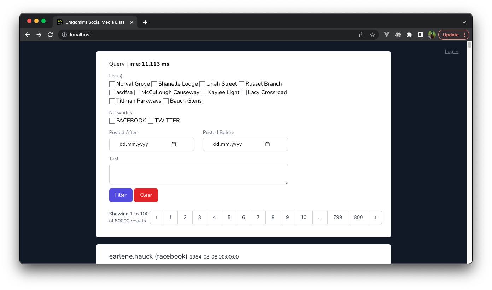
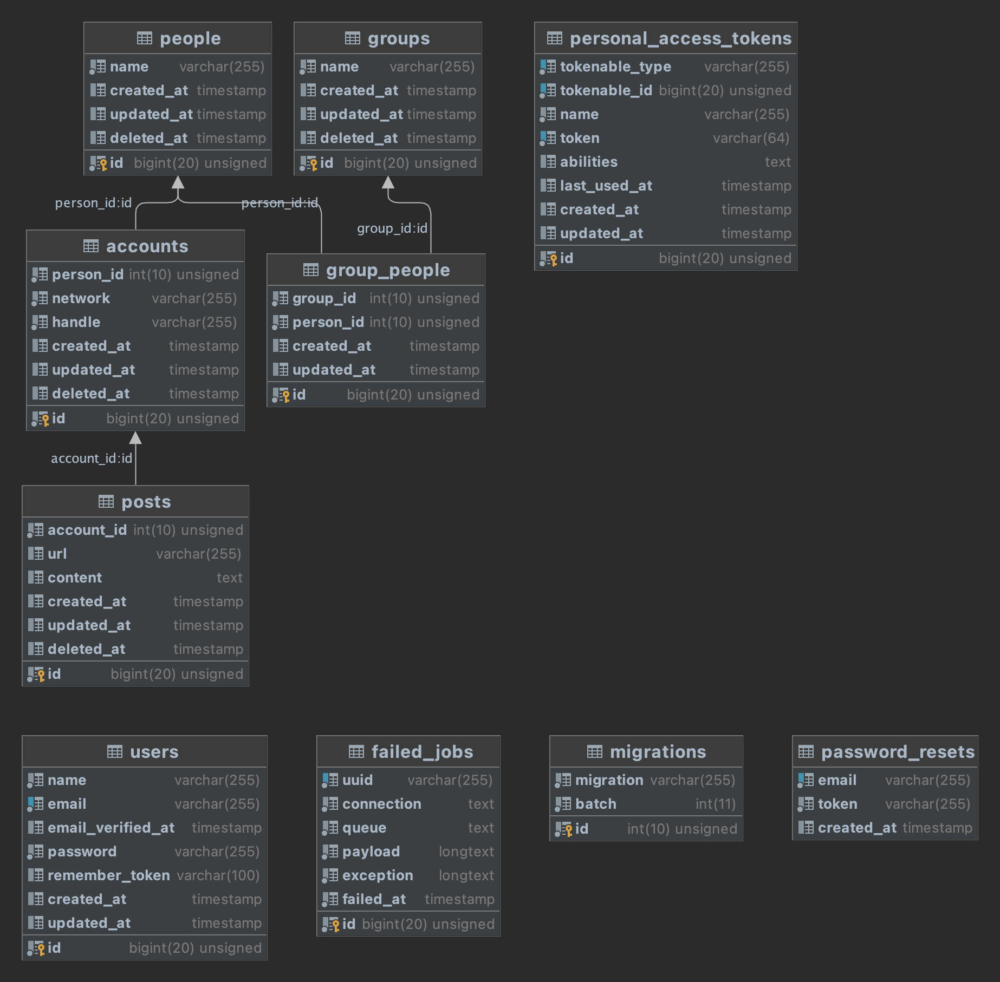

# Dragomir's Social Media List

This is a Laravel project since I'm most familiar with the PHP stack.

Models created:

- Person
- Group ( aka List, List class is reserved in PHP )
- Account
- Post

Those are linked the following way.

Running the project locally requires docker and docker-compose.
To have it running do the following:
- `docker-compose up -d`
- `docker-compose run composer composer install`
- `docker-composer exec php php artisan migrate`
- `docker-compose run node npm i && npm run prod`

And then you could access localhost

To fill in some demo data do:
- `docker-composer exec php php artisan seed`
- `docker-composer exec php php artisan demo:seed`

Then the app is good to be used.

## Concepts

Other than the internal patterns such as Facades and Factories, a Builder pattern was used to create the PostFilterService.
It modifies the internal prop several times by chaining the methods.

## Testing
There are mainly integration tests to find out how things work between each other. To run them, run:
- `docker-compose exec php php artisan test --parallel`

There are 33 test and 89 assertions at the moment of writing this document.

## Using the app
To view and create / remove lists, there is a small admin panel. To access it, hit the log in button in the top right corner,
and after seeding you can log in as "admin@dragomirt.com" and "admin" for email and password respectively.

The filters from the homepage can be chained and are preserved in the url, so the choices can be bookmarked.
Adding a new social media is as trivial as adding a new entry in the `App/Enum/NetworkEnum` file. It will be shown in the filters as an option right away, and it would be possible to add accounts based on that value.

Most models use softdeletes. That means that even if the parent or the model itself is deleted, it's rather archived with the possibility of eventual restoring, without losing the actual data.

The homepage is paginated to not exceed memory limit of the view, which in case of 20k+ posts is exceeded. The page size is set to 100 posts.

The demo data filler qty can be changed in the `database/seeder/DemoSeeder` to create whatever amount of users / accounts / posts / groups are needed.
To re-fill the data, run again the `docker-composer exec php php artisan demo:seed` command. That triggers the seeder. **It can take a while.**

At the top of the page there is as well a timer for the query. Since all filtering is done at the ORM level, only the needed data is loaded without filtering the retrieved collection, which gives this solution a respectable speed.
